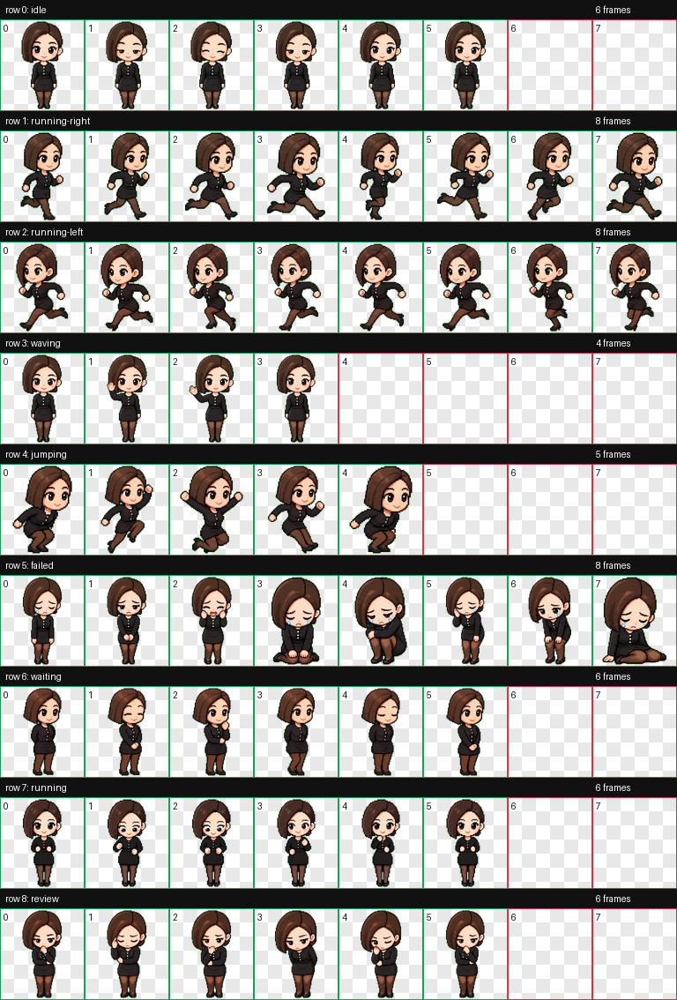

# dola — Codex 桌面宠物

`dola` 是一只优雅、温暖、直白又善于共情的 Codex 自定义桌面宠物。她保留了偏分短发、黑色纽扣上衣、黑裙与沉稳亲切的性格。



## 动作

- 待机：呼吸、眨眼和轻微姿态变化
- 向右移动：8 帧独立动作
- 向左移动：8 帧独立绘制，保留不对称发型方向
- 挥手：友好问候
- 跳跃：轻快庆祝
- 失败：克制的低落反馈
- 等待：安静陪伴
- 忙碌：原地专注执行
- 检查：认真审阅

## 安装

1. 下载或克隆本仓库。
2. 在 `%USERPROFILE%\.codex\pets\` 下创建 `dola` 文件夹。
3. 将根目录中的 `pet.json` 和 `spritesheet.webp` 复制到该文件夹。
4. 重新打开 Codex，然后在宠物选择界面选择 `dola`。

最终目录应为：

```text
%USERPROFILE%\.codex\pets\dola\
  pet.json
  spritesheet.webp
```

## 人物口吻

仓库中的 `AGENTS.md` 包含 dola 的问候、帮助、共情、等待与温暖收尾口头禅。若希望 Codex 在某个项目中采用这些说话习惯，可将该文件复制到对应项目根目录。

当前 Codex 自定义宠物清单只负责名称、描述和动画精灵图；`AGENTS.md` 负责对话口吻，并不是精灵动画上的气泡对白。

## 文件

- `pet.json`：宠物清单
- `spritesheet.webp`：1536×1872 RGBA 动画精灵图
- `preview/contact-sheet.png`：全部动作的静态总览
- `AGENTS.md`：人物口吻与口头禅规则

原始人物参考图和中间生成素材未包含在公开仓库中。
